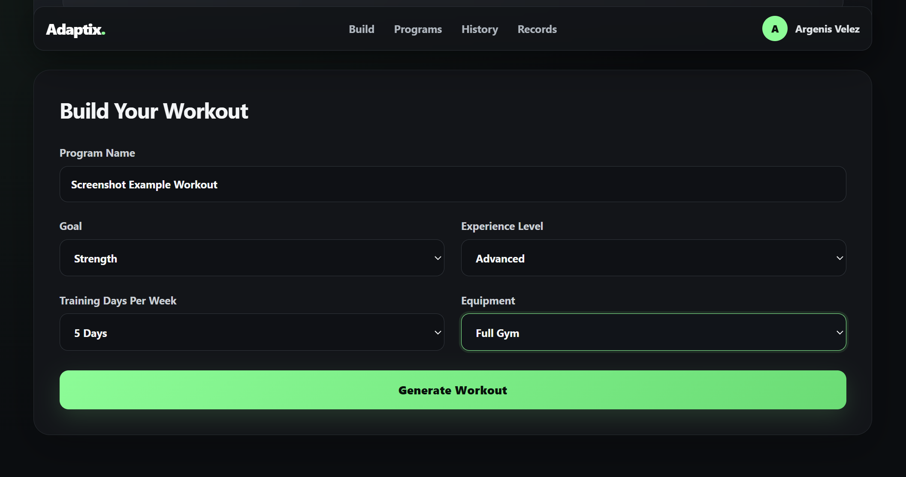
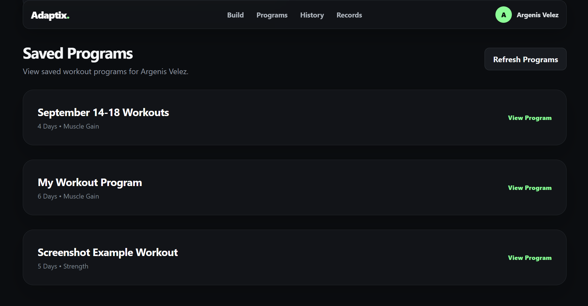
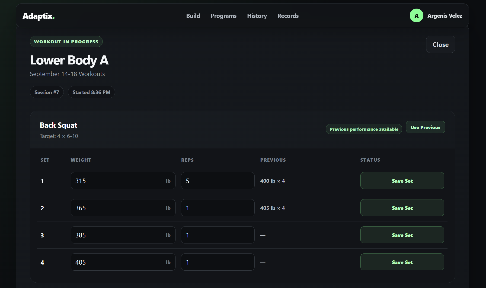
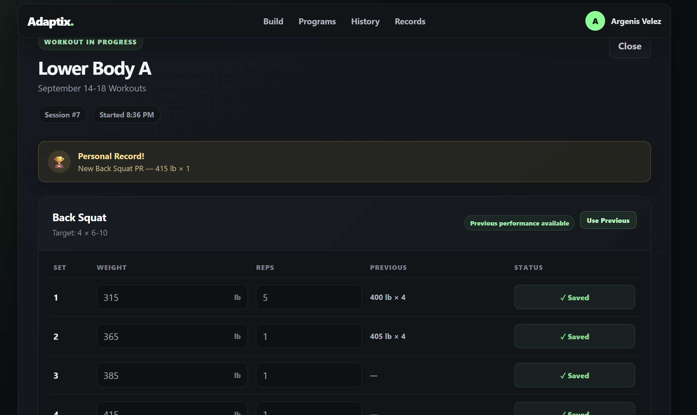
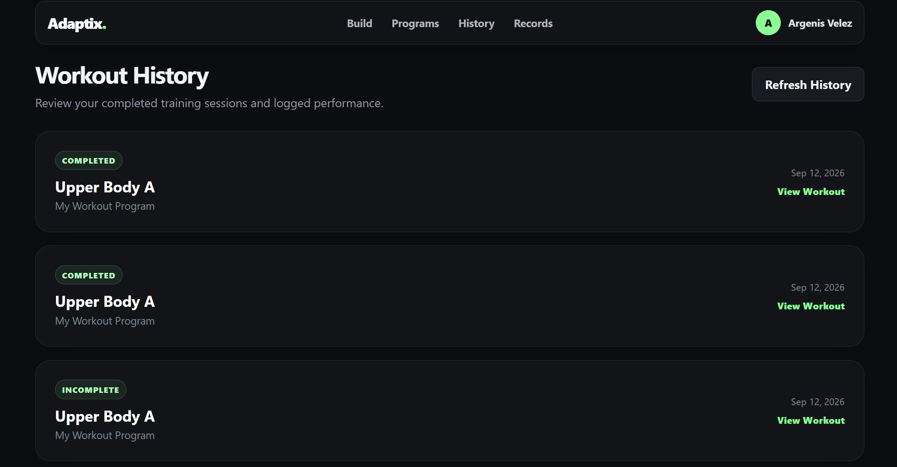
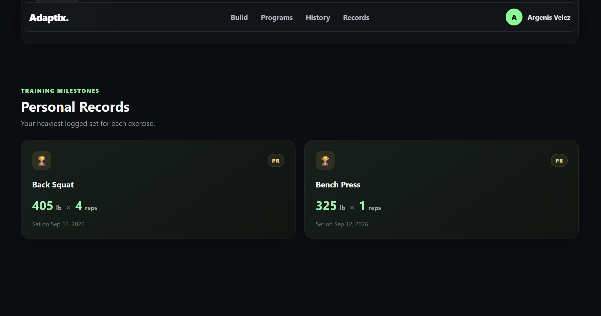

# Adaptix 

A full-stack personalized workout application built with React, TypeScript, FastAPI, and PostgreSQL.

Adaptix generates workout programs based on a user's training goals, experience level, weekly availability, and available equipment. Users can save programs, track workouts set-by-set, compare previous performance, reuse previous weights and reps, detect personal records, and review their workout history.

---

## ✨ Features

- Generate personalized workout programs based on:
  - Training goal
  - Experience level
  - Days per week
  - Available equipment
  - Persistent user profiles
  - Save generated workout programs
  - View previously saved programs
  - Delete workout programs
  - Start individual workout sessions
  - Log weight and repetitions for every set
  - Track workout start and completion times
  - Add notes to completed workouts
  - View previous performance for each exercise
  - Use the **Use Previous** button to automatically refill previous weights and reps
  - Detect new personal records while training
  - View complete workout history
  - Personal Records section showing the best logged performance for each exercise
  - Responsive React interface
  - PostgreSQL database for persistent storage
  - Automated backend testing with pytest
  - Database credentials stored securely using a `.env` file

---

## 🛠️ Tech Stack

### Frontend

- React
- TypeScript
- Vite
- CSS
- Fetch API
- React Hooks
- Local Storage

### Backend

- Python
- FastAPI
- Pydantic
- REST APIs

### Database

- PostgreSQL
- psycopg2
- SQL
- Relational database design

### Testing

- pytest
- FastAPI TestClient
- Dedicated PostgreSQL test database

### Development Tools

- Git
- GitHub
- VS Code
- pgAdmin 4

---

## Architecture

```text
┌──────────────────────────────┐
│       React + TypeScript     │
│          Frontend            │
│                              │
│ Workout Builder              │
│ Saved Programs               │
│ Workout Tracker              │
│ Workout History              │
│ Personal Records             │
└──────────────┬───────────────┘
               │
               │ HTTP / JSON
               ▼
┌──────────────────────────────┐
│           FastAPI            │
│           Backend            │
│                              │
│ User Management              │
│ Workout Generation           │
│ Program Management           │
│ Session Tracking             │
│ Set Logging                  │
└──────────────┬───────────────┘
               │
               │ SQL
               ▼
┌──────────────────────────────┐
│         PostgreSQL           │
│                              │
│ Users                        │
│ Programs                     │
│ Workout Days                 │
│ Exercises                    │
│ Sessions                     │
│ Set Logs                     │
└──────────────────────────────┘
```

---

## 📁 Project Structure

```text
Adaptix/
│
├── backend/
│   ├── __init__.py
│   ├── database.py
│   ├── exercise_library.py
│   ├── init_db.py
│   ├── main.py
│   ├── recommender.py
│   ├── schema.sql
│   ├── user_repository.py
│   ├── workout_generator.py
│   ├── workout_repository.py
│   └── workout_session_repository.py
│
├── frontend/
│   ├── public/
│   │   └── favicon.svg
│   │
│   ├── src/
│   │   ├── components/
│   │   │   ├── PersonalRecords.tsx
│   │   │   ├── ProfileBar.tsx
│   │   │   ├── SavedPrograms.tsx
│   │   │   ├── StartScreen.tsx
│   │   │   ├── TopNav.tsx
│   │   │   ├── WorkoutCard.tsx
│   │   │   ├── WorkoutForm.tsx
│   │   │   ├── WorkoutHistory.tsx
│   │   │   └── WorkoutTracker.tsx
│   │   │
│   │   ├── types/
│   │   │   └── workout.ts
│   │   │
│   │   ├── App.css
│   │   ├── App.tsx
│   │   ├── index.css
│   │   └── main.tsx
│   │
│   ├── index.html
│   ├── package.json
│   └── package-lock.json
│
├── tests/
│   ├── conftest.py
│   ├── test_api.py
│   ├── test_database.py
│   ├── test_recommender.py
│   ├── test_workout_database.py
│   ├── test_workout_generator.py
│   └── test_workout_sessions.py
│
├── screenshots/
│   ├── workout-builder.png
│   ├── saved-programs.png
│   ├── workout-tracker.png
│   ├── personal-record.png
│   ├── workout-history.png
│   └── personal-records.png
│
├── .env
├── .gitignore
├── requirements.txt
└── README.md
```

---

## Database Structure

Adaptix uses PostgreSQL with six main relational tables.

```text
users
  │
  └── workout_programs
        │
        └── workout_days
              │
              └── workout_exercises

users
  │
  └── workout_sessions
        │
        └── workout_set_logs
```

### Main Tables

- `users` — stores user profile information
- `workout_programs` — stores generated training programs
- `workout_days` — stores individual workout days
- `workout_exercises` — stores exercises assigned to each workout
- `workout_sessions` — stores started and completed workout sessions
- `workout_set_logs` — stores individual weight and repetition entries

Workout history keeps exercise and workout names even if an original saved program is later removed.

---

## 🔧 Prerequisites

Before running Adaptix, install:

- Python 3.11 or later
- PostgreSQL
- Node.js
- npm
- Git

Python dependencies can be installed using:

```bash
pip install -r requirements.txt
```

Frontend dependencies can be installed using:

```bash
cd frontend
npm install
```

---

## 🔑 The `.env` File

Create a `.env` file manually at the root of the project.

```env
DB_HOST=localhost
DB_PORT=5432
DB_NAME=personalized_workout_app
DB_USER=your_postgresql_username
DB_PASSWORD=your_postgresql_password

TEST_DB_NAME=personalized_workout_test
```

Do not commit the real `.env` file to GitHub.

The `.env` file is ignored by Git to protect database credentials.

---

## 💿 Create the Databases

Create the development database:

```sql
CREATE DATABASE personalized_workout_app;
```

Create the test database:

```sql
CREATE DATABASE personalized_workout_test;
```

Then initialize the Adaptix database schema from the project root:

```bash
python -m backend.init_db
```

This creates the required tables defined in:

```text
backend/schema.sql
```

---

## 🚀 Run the App

Adaptix requires both the FastAPI backend and React frontend to be running.

### 1. Start the Backend

From the project root:

```bash
python -m uvicorn backend.main:app --reload
```

The backend will run at:

```text
http://127.0.0.1:8000
```

FastAPI Swagger documentation:

```text
http://127.0.0.1:8000/docs
```

### 2. Start the Frontend

Open another terminal:

```bash
cd frontend
npm run dev
```

Then open:

```text
http://localhost:5173
```

---

## 🔌 API Endpoints

### Users

```text
POST    /api/users
GET     /api/users/{user_id}
PUT     /api/users/{user_id}
DELETE  /api/users/{user_id}
```

### Account

```text
POST    /api/account/start
```

### Workout Programs

```text
POST    /api/workouts/preview
POST    /api/users/{user_id}/workouts
GET     /api/users/{user_id}/workouts
DELETE  /api/users/{user_id}/workouts/{program_id}
```

### Workout Sessions

```text
POST    /api/users/{user_id}/sessions
GET     /api/users/{user_id}/sessions
```

### Workout Set Tracking

```text
POST    /api/users/{user_id}/sessions/{session_id}/sets
PUT     /api/users/{user_id}/sessions/{session_id}/complete
```

---

## 🧪 Testing

Adaptix includes automated backend testing for:

- Database connectivity
- User operations
- Workout recommendations
- Workout generation
- Workout persistence
- Workout deletion
- Workout sessions
- Individual set logging
- Session completion
- Workout history
- API endpoints
- Invalid session handling

Run the complete backend test suite from the project root:

```bash
python -m pytest -q
```

The project currently contains **29 passing automated backend tests**.

Frontend validation can be run with:

```bash
cd frontend
npm run lint
npm run build
```

---

## 📸 Screenshots

### 🧠 Personalized Workout Builder

Generate a workout based on your goal, experience level, weekly training frequency, and available equipment.



---

### 💾 Saved Workout Programs

Generated programs are stored in PostgreSQL and can be viewed again whenever the user returns.



---

### 🏋️ Workout Tracker

Track every set individually by entering the weight and number of repetitions performed.

Adaptix also displays the user's previous performance and allows previous values to be reused with the **Use Previous** button.



---

### 🏆 Personal Record Detection

Adaptix compares newly saved sets with previous workout history and detects when the user exceeds their previous maximum weight for an exercise.



---

### 📚 Workout History

Completed and incomplete workout sessions can be reviewed along with individual exercises, sets, weights, reps, timestamps, and workout notes.



---

### 🥇 Personal Records

The Personal Records section automatically calculates the heaviest logged performance for every exercise from the user's workout history.



---

## 💡 Notes

- `.env` is Git-ignored to protect PostgreSQL credentials.
- Workout data is persisted using PostgreSQL.
- Personal records are calculated dynamically from workout history.
- Previous performance is retrieved from previously completed workout sessions.
- The **Use Previous** feature fills previous weight and repetition values without automatically saving them.
- Workout sessions can retain historical exercise information even if the original saved workout program is deleted.
- Backend tests use a separate PostgreSQL test database.
- Adaptix is currently under active development.

---

## Future Improvements

Planned features include:

- 📈 Exercise-specific progress charts
- 📊 Training dashboard and statistics
- 🔍 Exercise-specific workout history
- 🏆 Expanded personal-record analytics
- ⚖️ Support for both pounds and kilograms
- 🔐 Full authentication and authorization
- 📱 Additional mobile UI improvements
- 🌐 Production deployment

---

## 👨‍💻 Developer

**Argenis Y. Vélez Álvarez**

Computer Engineering student at the Polytechnic University of Puerto Rico.

Interested in software engineering, cybersecurity, IT, embedded systems, and full-stack development.


---

## 📄 License

This project is intended for educational, portfolio, and professional development purposes.
