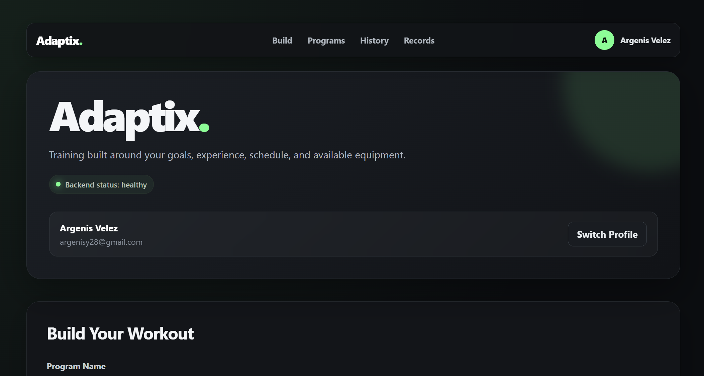
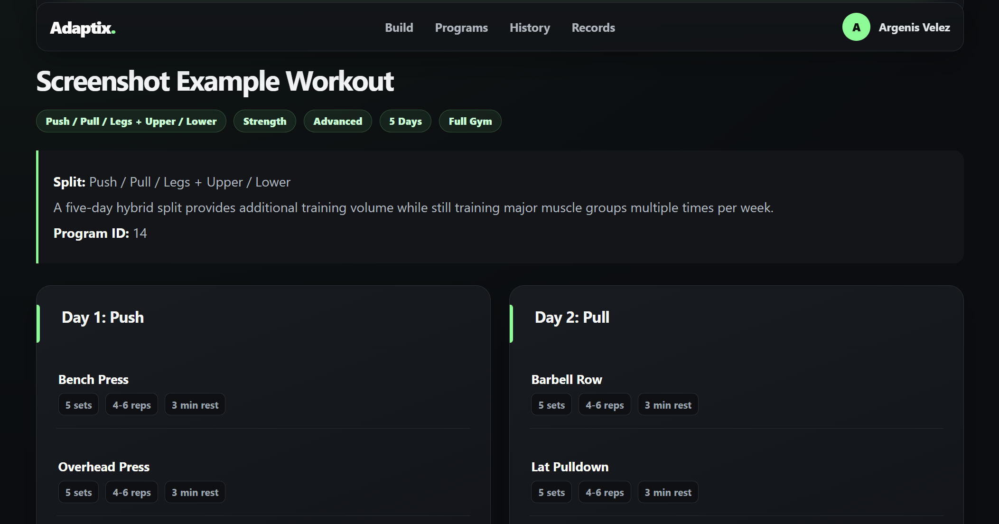

# Adaptix 🏋️

A full-stack personalized workout application built with React, TypeScript, FastAPI, and PostgreSQL.

Adaptix generates workout programs based on a user's training goals, experience level, weekly availability, and available equipment. Users can save programs, track workouts set-by-set, compare previous performance, reuse previous weights and reps, detect personal records, and review their workout history.

---

## ✨ Features

- 🧠 Generate personalized workout programs based on:
  - Training goal
  - Experience level
  - Training days per week
  - Available equipment
- 👤 Persistent user profiles
- 💾 Save generated workout programs
- 📋 View previously saved workout programs
- 🗑️ Delete saved programs
- 🏋️ Start individual workout sessions
- 📊 Log weight and repetitions for every set
- ⏱️ Track workout start and completion times
- 📝 Add notes to workout sessions
- 🔁 View previous performance for each exercise
- ↩️ Reuse previous weights and reps with the **Use Previous** feature
- 🏆 Detect new personal records while training
- 📚 Review completed and incomplete workout history
- 🥇 Personal Records section showing the best logged performance for each exercise
- 📱 Responsive React interface
- 🗄️ PostgreSQL database for persistent storage
- 🧪 Automated backend testing with pytest
- 🔐 Database credentials protected with a `.env` file

---

## 🛠️ Tech Stack

### Frontend

- React
- TypeScript
- Vite
- CSS
- Fetch API
- React Hooks
- Local Storage

### Backend

- Python
- FastAPI
- Pydantic
- REST APIs

### Database

- PostgreSQL
- psycopg2
- SQL
- Relational database design
- SQL JOINs

### Testing

- pytest
- FastAPI TestClient
- Dedicated PostgreSQL test database

### Development Tools

- Git
- GitHub
- VS Code
- pgAdmin 4

---

## 🏗️ Architecture

```text
┌──────────────────────────────┐
│      React + TypeScript      │
│           Frontend           │
│                              │
│  Workout Builder             │
│  Saved Programs              │
│  Workout Tracker             │
│  Workout History             │
│  Personal Records            │
└──────────────┬───────────────┘
               │
               │ HTTP / JSON
               ▼
┌──────────────────────────────┐
│           FastAPI            │
│           Backend            │
│                              │
│  User Management             │
│  Workout Generation          │
│  Program Management          │
│  Session Tracking            │
│  Set Logging                 │
└──────────────┬───────────────┘
               │
               │ SQL
               ▼
┌──────────────────────────────┐
│         PostgreSQL           │
│                              │
│  Users                       │
│  Programs                    │
│  Workout Days                │
│  Exercises                   │
│  Sessions                    │
│  Set Logs                    │
└──────────────────────────────┘
```

The React frontend handles workout creation, saved programs, workout tracking, history, and personal records.

FastAPI provides REST endpoints for user management, workout generation, program persistence, workout sessions, and set logging.

PostgreSQL stores users, workout programs, workout days, exercises, workout sessions, and individual set logs.

---

## 📁 Project Structure

```text
personalized-workout-app/
│
├── backend/
│   ├── __init__.py
│   ├── database.py
│   ├── exercise_library.py
│   ├── init_db.py
│   ├── main.py
│   ├── recommender.py
│   ├── schema.sql
│   ├── user_repository.py
│   ├── workout_generator.py
│   ├── workout_repository.py
│   └── workout_session_repository.py
│
├── frontend/
│   ├── public/
│   │   └── favicon.svg
│   │
│   ├── src/
│   │   ├── components/
│   │   │   ├── PersonalRecords.tsx
│   │   │   ├── ProfileBar.tsx
│   │   │   ├── SavedPrograms.tsx
│   │   │   ├── StartScreen.tsx
│   │   │   ├── TopNav.tsx
│   │   │   ├── WorkoutCard.tsx
│   │   │   ├── WorkoutForm.tsx
│   │   │   ├── WorkoutHistory.tsx
│   │   │   └── WorkoutTracker.tsx
│   │   │
│   │   ├── types/
│   │   │   └── workout.ts
│   │   │
│   │   ├── App.css
│   │   ├── App.tsx
│   │   ├── index.css
│   │   └── main.tsx
│   │
│   ├── index.html
│   ├── package.json
│   └── package-lock.json
│
├── tests/
│   ├── conftest.py
│   ├── test_api.py
│   ├── test_database.py
│   ├── test_recommender.py
│   ├── test_workout_database.py
│   ├── test_workout_generator.py
│   └── test_workout_sessions.py
│
├── screenshots/
│   ├── app-overview.png
│   ├── workout-builder.png
│   ├── generated-workout.png
│   ├── saved-programs.png
│   ├── workout-tracker.png
│   ├── personal-record.png
│   ├── workout-history.png
│   └── personal-records.png
│
├── .env
├── .gitignore
├── README.md
└── requirements.txt
```

---

## 🗄️ Database Structure

Adaptix uses PostgreSQL with six main relational tables.

```text
users
  │
  └── workout_programs
        │
        └── workout_days
              │
              └── workout_exercises

users
  │
  └── workout_sessions
        │
        └── workout_set_logs
```

### Main Tables

- `users` — stores user profile information
- `workout_programs` — stores generated training programs
- `workout_days` — stores individual workout days
- `workout_exercises` — stores exercises assigned to each workout day
- `workout_sessions` — stores started and completed workout sessions
- `workout_set_logs` — stores individual weight and repetition entries

Workout history keeps useful exercise and workout information even if an original saved workout program is later removed.

---

## 🔧 Prerequisites

Before running Adaptix, install:

- Python 3.11 or later
- PostgreSQL
- Node.js
- npm
- Git

Install the Python dependencies from the project root:

```bash
pip install -r requirements.txt
```

Install the frontend dependencies:

```bash
cd frontend
npm install
```

---

## 🔑 The `.env` File

Create a `.env` file manually at the root of the project.

```env
DB_HOST=localhost
DB_PORT=5432
DB_NAME=personalized_workout_app
DB_USER=your_postgresql_username
DB_PASSWORD=your_postgresql_password

TEST_DB_NAME=personalized_workout_test
```

Do not commit the real `.env` file to GitHub.

The `.env` file is ignored by Git to protect database credentials.

---

## 💿 Create the Databases

Create the development database:

```sql
CREATE DATABASE personalized_workout_app;
```

Create the test database:

```sql
CREATE DATABASE personalized_workout_test;
```

Then initialize the Adaptix database schema from the project root:

```bash
python -m backend.init_db
```

This creates the tables defined in:

```text
backend/schema.sql
```

---

## 🚀 Run the App

Adaptix requires both the FastAPI backend and React frontend to be running.

### 1. Start the Backend

From the project root:

```bash
python -m uvicorn backend.main:app --reload
```

The backend runs at:

```text
http://127.0.0.1:8000
```

FastAPI Swagger documentation is available at:

```text
http://127.0.0.1:8000/docs
```

### 2. Start the Frontend

Open another terminal:

```bash
cd frontend
npm run dev
```

Then open:

```text
http://localhost:5173
```

---

## 🔌 API Endpoints

### Users

```text
POST    /api/users
GET     /api/users/{user_id}
PUT     /api/users/{user_id}
DELETE  /api/users/{user_id}
```

### Account

```text
POST    /api/account/start
```

### Workout Programs

```text
POST    /api/workouts/preview
POST    /api/users/{user_id}/workouts
GET     /api/users/{user_id}/workouts
DELETE  /api/users/{user_id}/workouts/{program_id}
```

### Workout Sessions

```text
POST    /api/users/{user_id}/sessions
GET     /api/users/{user_id}/sessions
```

### Workout Set Tracking

```text
POST    /api/users/{user_id}/sessions/{session_id}/sets
PUT     /api/users/{user_id}/sessions/{session_id}/complete
```

---

## 🧪 Testing

Adaptix includes automated backend tests covering:

- Database connectivity
- User operations
- Workout recommendations
- Workout generation
- Workout persistence
- Workout deletion
- Workout sessions
- Individual set logging
- Session completion
- Workout history
- API endpoints
- Invalid session handling

Run the complete backend test suite from the project root:

```bash
python -m pytest -q
```

The current backend test suite contains **29 passing automated tests**.

Frontend validation can be run with:

```bash
cd frontend
npm run lint
npm run build
```

---

## 📸 Screenshots

### 🖥️ Application Overview

Adaptix provides a responsive interface for building, managing, and tracking personalized workout programs.



---

### 🧠 Personalized Workout Builder

Users can configure a workout using their training goal, experience level, weekly schedule, and available equipment.


---

### 🏋️ Generated Workout Program

Adaptix recommends an appropriate training split and generates individual workout days with exercises, sets, rep ranges, and rest periods.



---

### 💾 Saved Programs

Generated workout programs are stored in PostgreSQL and can be reopened and used for future workout sessions.


---

### 📊 Workout Tracker

Workout sessions can be tracked set-by-set by entering the weight and repetitions performed.

Adaptix displays previous performance and allows previous weight and repetition values to be reused with the **Use Previous** feature.


---

### 🏆 Personal Record Detection

Adaptix compares newly logged sets with previous workout performance and notifies the user when a new weight-based personal record is achieved.


---

### 📚 Workout History

Completed and incomplete workout sessions can be reviewed along with their logged training performance.


---

### 🥇 Personal Records

Adaptix automatically calculates the heaviest logged set for each exercise and displays it in a dedicated Personal Records section.


---

## 💡 Notes

- `.env` is Git-ignored to protect PostgreSQL credentials.
- Workout data is persisted using PostgreSQL.
- Personal records are calculated dynamically from workout history.
- Previous performance is retrieved from previously completed workout sessions.
- The **Use Previous** feature fills previous weight and repetition values without automatically saving them.
- Workout sessions retain useful historical exercise information even if the original saved program is deleted.
- Backend tests use a separate PostgreSQL test database.
- Adaptix is currently under active development.

---

## 🔮 Future Improvements

Planned features include:

- 📈 Exercise-specific progress charts
- 📊 Training dashboard and statistics
- 🔍 Exercise-specific workout history
- 🏆 Expanded personal-record analytics
- ⚖️ Support for both pounds and kilograms
- 🔐 Full authentication and authorization
- 📱 Additional mobile UI improvements
- 🌐 Production deployment

---

## 👨‍💻 Developer

**Argenis Y. Vélez Álvarez**

Computer Engineering student at the Polytechnic University of Puerto Rico.

Interested in software engineering, cybersecurity, IT, embedded systems, and full-stack development.

---

## 📄 License

This project is intended for educational, portfolio, and professional development purposes.
