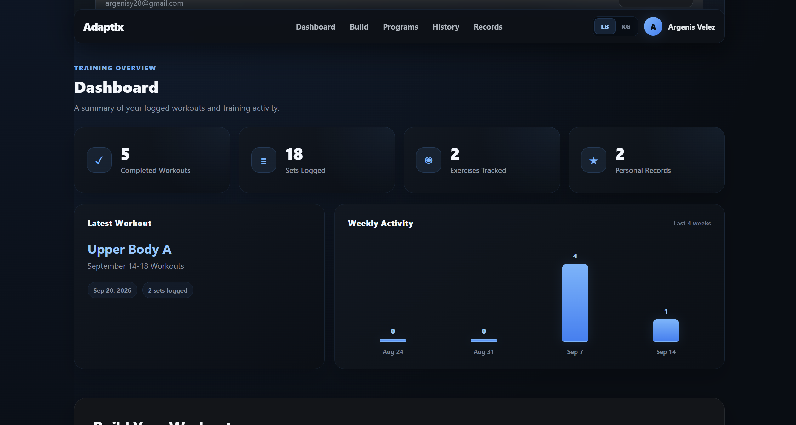
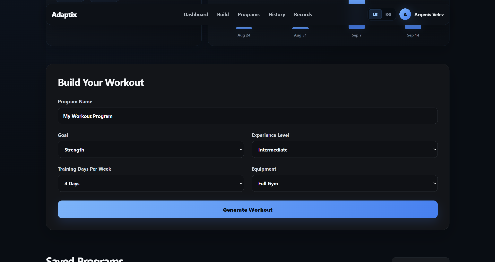
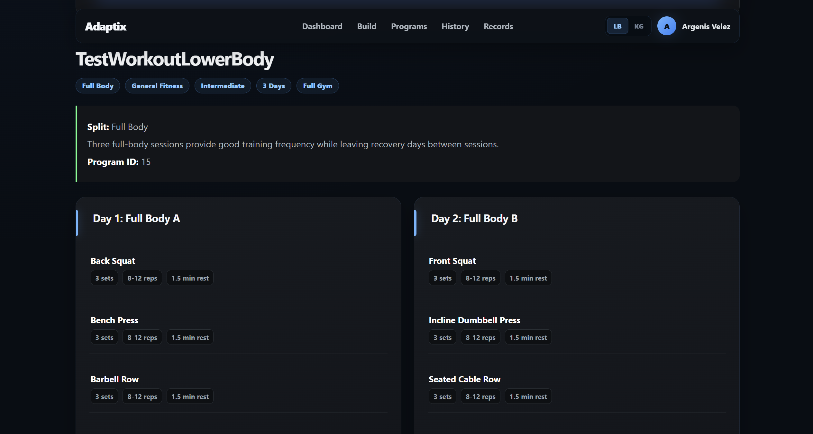
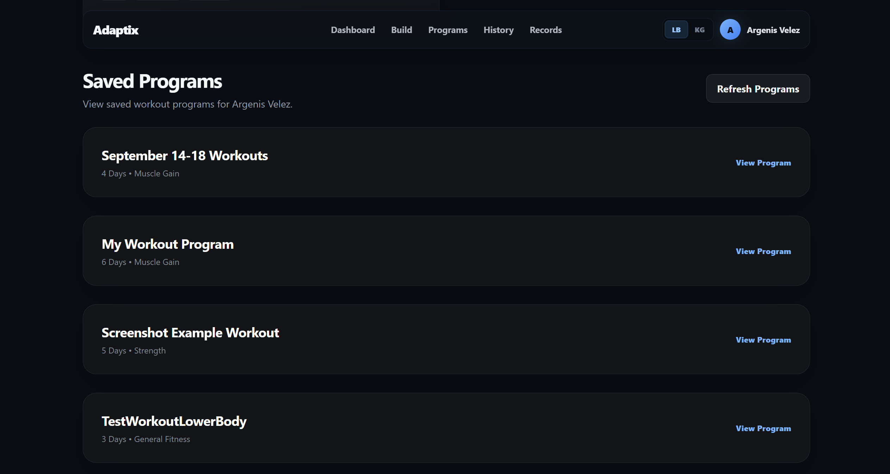
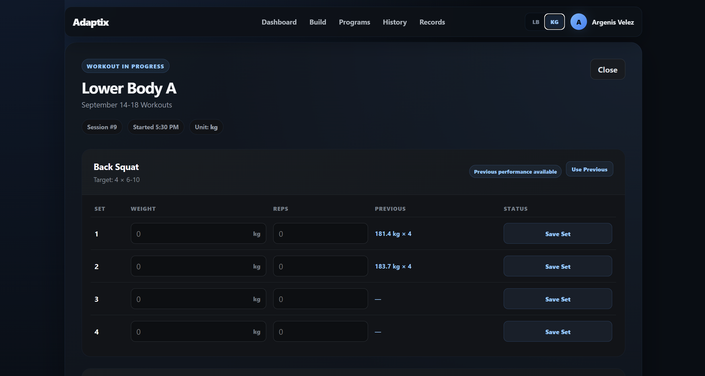
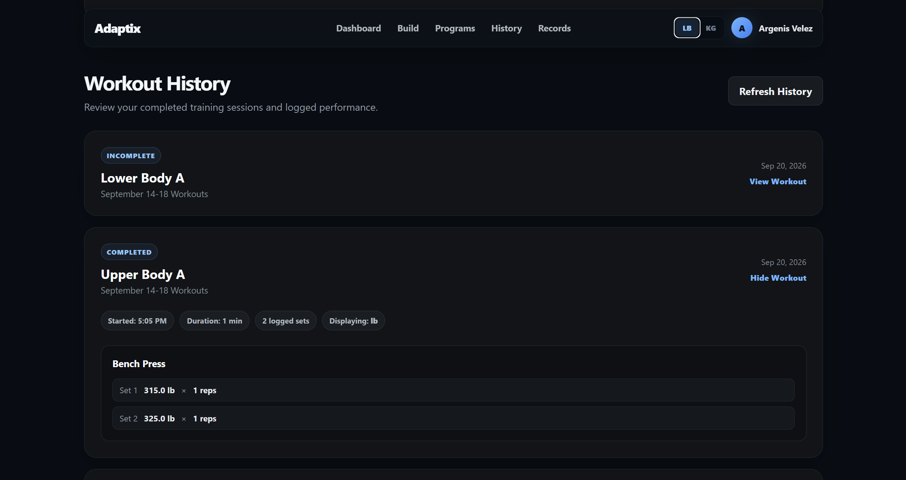
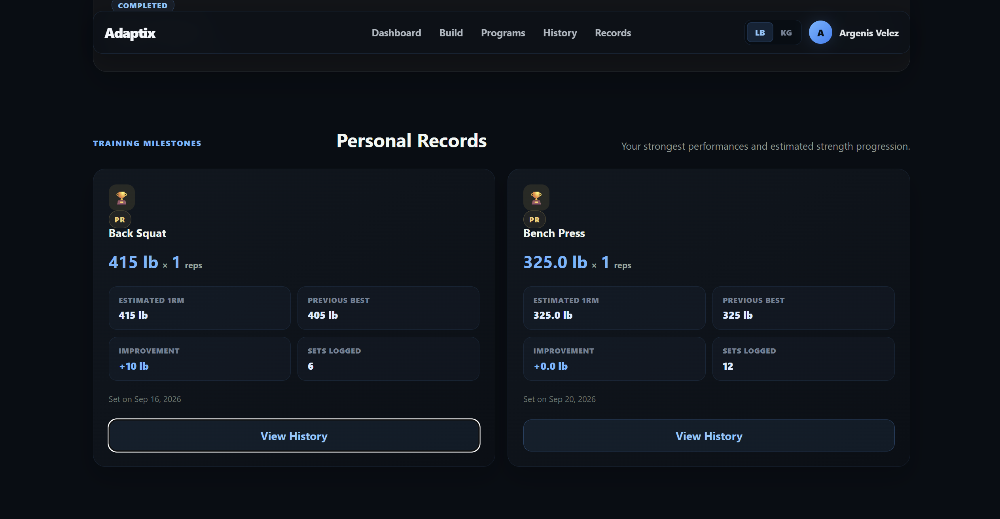
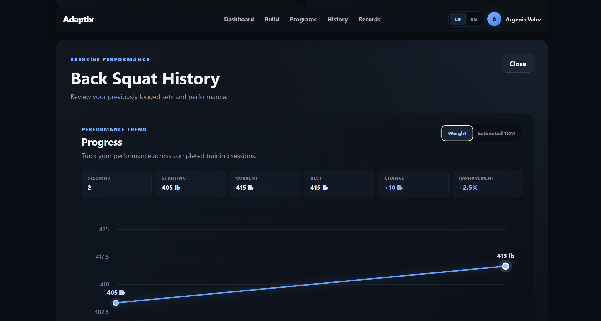

# Adaptix 🏋️

A full-stack personalized workout planning and training analytics application built with React, TypeScript, FastAPI, and PostgreSQL.

Adaptix generates personalized workout programs based on a user's training goals, experience level, weekly availability, and available equipment. Beyond workout generation, the application provides an end-to-end training workflow with saved programs, workout session tracking, set logging, previous-performance recall, personal record detection, workout history, exercise-specific analytics, progress charts, dashboard statistics, and persistent lb/kg unit preferences.

---

## ✨ Features

### 🧠 Personalized Workout Generation

- Generate workout programs based on:
  - Training goal
  - Experience level
  - Training days per week
  - Available equipment
- Automatically recommend an appropriate training split
- Generate exercises, sets, repetition ranges, and rest periods
- Save generated programs to PostgreSQL

### 👤 User Experience

- Persistent user profiles
- Responsive dark interface
- Blue Adaptix visual theme
- Top navigation for:
  - Dashboard
  - Workout Builder
  - Saved Programs
  - Workout History
  - Personal Records
- Persistent lb/kg preference using Local Storage

### 💾 Workout Program Management

- Save generated workout programs
- View previously saved programs
- Reopen programs for future workouts
- Start individual workout days
- Delete saved programs

### 🏋️ Workout Tracking

- Start and complete workout sessions
- Log weight and repetitions for every set
- Track workout start and completion times
- Add notes to workout sessions
- Track saved and unsaved sets
- Review previous performance for each exercise
- Reuse previous weights and repetitions with **Use Previous**
- Automatically detect new weight-based personal records

### 📚 Workout History

- Review completed and incomplete workout sessions
- View:
  - Program name
  - Workout day
  - Date
  - Start time
  - Duration
  - Logged sets
  - Workout notes
- Group historical sets by exercise
- Automatically convert historical weights into the currently selected lb/kg preference

### 🥇 Personal Record Analytics

- Automatically determine the strongest logged performance for each exercise
- Display:
  - Current personal record
  - Previous best
  - Estimated 1RM
  - Improvement from previous PR
  - Total sets logged
  - Date achieved
- Open exercise-specific history directly from each PR card

### 📈 Exercise Progress Analytics

- Exercise-specific training history
- Interactive progress visualization
- Switch between:
  - **Weight**
  - **Estimated 1RM**
- Display:
  - Sessions completed
  - Starting performance
  - Current performance
  - Best performance
  - Absolute change
  - Percentage improvement
- Highlight the best recorded performance
- Review individual historical sets below the chart

### 📊 Training Dashboard

- Completed workouts
- Total sets logged
- Exercises tracked
- Personal records tracked
- Latest completed workout
- Weekly activity over the previous four weeks

### ⚖️ lb / kg Support

- Persistent global weight-unit preference
- Save new workout sets in either pounds or kilograms
- Automatically convert historical data for display
- Convert previous-performance values
- Unit-aware **Use Previous**
- Mixed-unit personal record comparisons
- Unit-aware PR analytics and progress charts
- Original database values remain stored in their original units

### 🧪 Testing and Data

- PostgreSQL persistent storage
- Dedicated PostgreSQL test database
- Automated backend testing with pytest
- Frontend linting and production-build validation
- Database credentials protected with `.env`

---

## 🛠️ Tech Stack

### Frontend

- React
- TypeScript
- Vite
- CSS
- Fetch API
- React Hooks
- Local Storage
- SVG-based progress visualization

### Backend

- Python
- FastAPI
- Pydantic
- REST APIs

### Database

- PostgreSQL
- psycopg2
- SQL
- Relational database design
- SQL JOINs

### Testing

- pytest
- FastAPI TestClient
- Dedicated PostgreSQL test database
- ESLint
- Vite production builds

### Development Tools

- Git
- GitHub
- VS Code
- pgAdmin 4

---

## 🏗️ Architecture

```text
┌────────────────────────────────────┐
│         React + TypeScript         │
│              Frontend              │
│                                    │
│  Training Dashboard                │
│  Workout Builder                   │
│  Saved Programs                    │
│  Workout Tracker                   │
│  Workout History                   │
│  Personal Records                  │
│  Exercise History                  │
│  Progress Analytics                │
│  lb / kg Preferences               │
└──────────────────┬─────────────────┘
                   │
                   │ HTTP / JSON
                   ▼
┌────────────────────────────────────┐
│              FastAPI               │
│              Backend               │
│                                    │
│  User Management                   │
│  Workout Generation                │
│  Program Management                │
│  Session Tracking                  │
│  Set Logging                       │
│  Workout History                   │
└──────────────────┬─────────────────┘
                   │
                   │ SQL
                   ▼
┌────────────────────────────────────┐
│             PostgreSQL             │
│                                    │
│  Users                             │
│  Workout Programs                  │
│  Workout Days                      │
│  Workout Exercises                 │
│  Workout Sessions                  │
│  Workout Set Logs                  │
└────────────────────────────────────┘
```

The React frontend manages workout creation, saved programs, training sessions, historical performance, analytics, charts, and user preferences.

FastAPI provides REST endpoints for user management, workout generation, program persistence, workout sessions, set logging, and workout history.

PostgreSQL provides relational persistent storage for user profiles, workout programs, individual workout days, exercises, workout sessions, and set-level performance data.

Historical weight values remain stored using the unit in which they were originally logged. The frontend converts those values dynamically according to the user's current lb/kg preference.

---

## 📁 Project Structure

```text
personalized-workout-app/
│
├── backend/
│   ├── __init__.py
│   ├── database.py
│   ├── exercise_library.py
│   ├── init_db.py
│   ├── main.py
│   ├── recommender.py
│   ├── schema.sql
│   ├── user_repository.py
│   ├── workout_generator.py
│   ├── workout_repository.py
│   └── workout_session_repository.py
│
├── frontend/
│   ├── public/
│   │   └── favicon.svg
│   │
│   ├── src/
│   │   ├── components/
│   │   │   ├── ExerciseHistory.tsx
│   │   │   ├── ExerciseProgressChart.tsx
│   │   │   ├── PersonalRecords.tsx
│   │   │   ├── ProfileBar.tsx
│   │   │   ├── SavedPrograms.tsx
│   │   │   ├── StartScreen.tsx
│   │   │   ├── TopNav.tsx
│   │   │   ├── TrainingDashboard.tsx
│   │   │   ├── WeightUnitToggle.tsx
│   │   │   ├── WorkoutCard.tsx
│   │   │   ├── WorkoutForm.tsx
│   │   │   ├── WorkoutHistory.tsx
│   │   │   └── WorkoutTracker.tsx
│   │   │
│   │   ├── types/
│   │   │   └── workout.ts
│   │   │
│   │   ├── utils/
│   │   │   └── weight.ts
│   │   │
│   │   ├── App.css
│   │   ├── App.tsx
│   │   ├── index.css
│   │   └── main.tsx
│   │
│   ├── index.html
│   ├── package.json
│   └── package-lock.json
│
├── tests/
│   ├── conftest.py
│   ├── test_api.py
│   ├── test_database.py
│   ├── test_recommender.py
│   ├── test_workout_database.py
│   ├── test_workout_generator.py
│   └── test_workout_sessions.py
│
├── screenshots/
│   ├── 01-dashboard.png
│   ├── 02-workout-builder.png
│   ├── 03-generated-workout.png
│   ├── 04-saved-programs.png
│   ├── 05-workout-tracker.png
│   ├── 06-workout-history.png
│   ├── 07-personal-records.png
│   └── 08-exercise-progress.png
│
├── .env
├── .gitignore
├── README.md
└── requirements.txt
```

---

## 🗄️ Database Structure

Adaptix uses PostgreSQL with six main relational tables.

```text
users
  │
  └── workout_programs
        │
        └── workout_days
              │
              └── workout_exercises

users
  │
  └── workout_sessions
        │
        └── workout_set_logs
```

### Main Tables

- `users` — stores user profile information
- `workout_programs` — stores generated training programs
- `workout_days` — stores individual workout days
- `workout_exercises` — stores exercises assigned to each workout day
- `workout_sessions` — stores started and completed workout sessions
- `workout_set_logs` — stores individual weight and repetition entries

Workout history retains useful exercise and workout information even if an original saved workout program is later removed.

Weight logs also retain the unit in which each set was originally recorded, allowing Adaptix to support mixed lb/kg history while dynamically converting values for display.

---

## 🔧 Prerequisites

Before running Adaptix, install:

- Python 3.11 or later
- PostgreSQL
- Node.js
- npm
- Git

Install the Python dependencies from the project root:

```bash
pip install -r requirements.txt
```

Install the frontend dependencies:

```bash
cd frontend
npm install
```

---

## 🔑 The `.env` File

Create a `.env` file manually at the root of the project.

```env
DB_HOST=localhost
DB_PORT=5432
DB_NAME=personalized_workout_app
DB_USER=your_postgresql_username
DB_PASSWORD=your_postgresql_password

TEST_DB_NAME=personalized_workout_test
```

Do not commit the real `.env` file to GitHub.

The `.env` file is ignored by Git to protect database credentials.

---

## 💿 Create the Databases

Create the development database:

```sql
CREATE DATABASE personalized_workout_app;
```

Create the test database:

```sql
CREATE DATABASE personalized_workout_test;
```

Then initialize the Adaptix database schema from the project root:

```bash
python -m backend.init_db
```

This creates the tables defined in:

```text
backend/schema.sql
```

---

## 🚀 Run the App

Adaptix requires both the FastAPI backend and React frontend to be running.

### 1. Start the Backend

From the project root:

```bash
python -m uvicorn backend.main:app --reload
```

The backend runs at:

```text
http://127.0.0.1:8000
```

FastAPI Swagger documentation is available at:

```text
http://127.0.0.1:8000/docs
```

### 2. Start the Frontend

Open another terminal:

```bash
cd frontend
npm run dev
```

Then open:

```text
http://localhost:5173
```

---

## 🔌 API Endpoints

### Users

```text
POST    /api/users
GET     /api/users/{user_id}
PUT     /api/users/{user_id}
DELETE  /api/users/{user_id}
```

### Account

```text
POST    /api/account/start
```

### Workout Programs

```text
POST    /api/workouts/preview
POST    /api/users/{user_id}/workouts
GET     /api/users/{user_id}/workouts
DELETE  /api/users/{user_id}/workouts/{program_id}
```

### Workout Sessions

```text
POST    /api/users/{user_id}/sessions
GET     /api/users/{user_id}/sessions
```

### Workout Set Tracking

```text
POST    /api/users/{user_id}/sessions/{session_id}/sets
PUT     /api/users/{user_id}/sessions/{session_id}/complete
```

---

## 🧪 Testing

Adaptix includes automated backend tests covering:

- Database connectivity
- User operations
- Workout recommendations
- Workout generation
- Workout persistence
- Workout deletion
- Workout sessions
- Individual set logging
- Session completion
- Workout history
- API endpoints
- Invalid session handling

Run the complete backend test suite from the project root:

```bash
python -m pytest -q
```

The current backend test suite contains **29 passing automated tests**.

Frontend validation can be run with:

```bash
cd frontend
npm run lint
npm run build
```

---

# 📸 Screenshots

## 📊 Training Dashboard

The Adaptix dashboard provides an overview of training activity, including completed workouts, logged sets, tracked exercises, personal records, the latest completed workout, and recent weekly activity.



---

## 🧠 Personalized Workout Builder

Users can configure a workout program using their training goal, experience level, weekly schedule, and available equipment.



---

## 🏋️ Generated Workout Program

Adaptix recommends an appropriate training split and generates individual workout days containing exercises, sets, repetition ranges, and rest periods.



---

## 💾 Saved Programs

Generated workout programs are persisted in PostgreSQL and can be reopened to start future workout sessions.



---

## 🏋️ Workout Tracker

The workout tracker provides set-by-set weight and repetition logging.

Adaptix retrieves previous exercise performance and provides a **Use Previous** feature for quickly reusing prior weights and repetitions. New sets are also compared against historical performance for personal-record detection.

The selected lb/kg preference is respected while entering new training data and reviewing previous performance.



---

## 📚 Workout History

Completed and incomplete workout sessions can be reviewed along with their program, workout day, duration, exercises, sets, repetitions, and notes.

Historical weights automatically convert to the user's currently selected lb/kg preference without modifying the originally stored workout data.



---

## 🥇 Personal Records

Adaptix analyzes workout history to identify the strongest logged performance for each exercise.

Each Personal Record card includes the current best performance, estimated 1RM, previous best, improvement, number of logged sets, and date achieved.



---

## 📈 Exercise Progress Analytics

Each tracked exercise has its own history and performance analytics.

Users can switch between **Weight** and **Estimated 1RM** views while reviewing session count, starting performance, current performance, best performance, absolute change, percentage improvement, and historical sets.



---

## ⚖️ Weight Unit System

Adaptix supports both pounds and kilograms through a persistent global preference.

Changing the selected unit dynamically updates:

- Workout tracker weight inputs
- Previous performance
- **Use Previous** values
- Workout history
- Personal Records
- Estimated 1RM
- Exercise history
- Progress charts
- PR comparisons

Historical database entries remain stored using their original units and are converted only when displayed.

This allows workout history containing both lb and kg entries to be compared correctly.

---

## 🧮 Estimated 1RM

Adaptix uses the Epley formula to estimate one-repetition maximum strength from logged sets:

```text
Estimated 1RM = Weight × (1 + Repetitions / 30)
```

For single-repetition sets, the logged weight itself is treated as the estimated 1RM.

The application evaluates completed sets from each training session to determine the strongest estimated 1RM for progress analytics.

---

## 💡 Implementation Notes

- `.env` is Git-ignored to protect PostgreSQL credentials.
- Workout data is persisted using PostgreSQL.
- Personal records are calculated dynamically from workout history.
- PR comparisons normalize mixed lb/kg values before comparing performance.
- Previous performance is retrieved from previously completed workout sessions.
- **Use Previous** converts historical weight values into the currently selected unit before filling workout inputs.
- Changing the lb/kg preference does not rewrite historical database records.
- Weight conversion logic is centralized in a reusable frontend utility.
- Exercise-specific progress charts are generated from logged workout history.
- Estimated 1RM analytics use completed set data.
- Workout sessions retain useful historical exercise information even if the original saved program is deleted.
- Backend tests use a separate PostgreSQL test database.
- Adaptix is currently under active development.

---

## 🔮 Future Improvements

Planned future improvements include:

- 🔐 Secure authentication and authorization
- 🔑 Password hashing and session/token-based authentication
- ✏️ Workout and program editing
- ➕ Custom exercise creation
- 🔍 Exercise search and filtering
- 📊 Expanded training-volume analytics
- 🔥 Workout streak tracking
- 📅 Calendar-based workout history
- 📱 Additional mobile workout UX improvements
- 🧪 Automated frontend component and integration testing
- 🤖 AI-assisted workout recommendations
- ☁️ Cloud-hosted PostgreSQL database
- 🌐 Production deployment

---

## 👨‍💻 Developer

**Argenis Y. Vélez Álvarez**

Computer Engineering student at the Polytechnic University of Puerto Rico.

Interested in software engineering, cybersecurity, IT, embedded systems, and full-stack development.


---

## 📄 License

This project is intended for educational, portfolio, and professional development purposes.